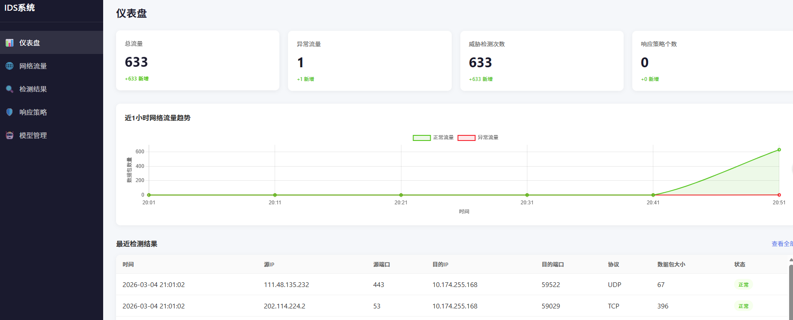
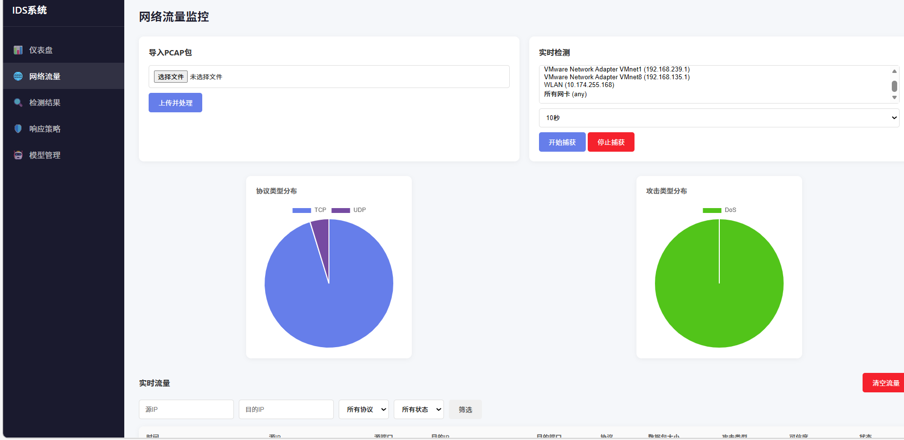
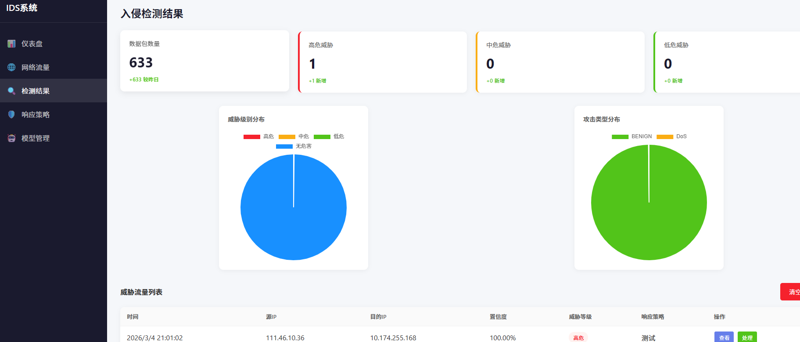
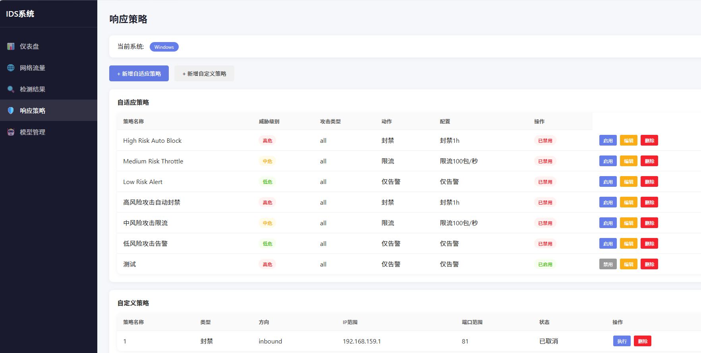
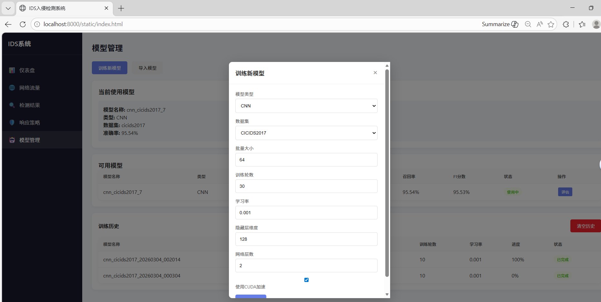

# 基于CNN的入侵检测及自适应响应系统
  通过设计一维卷积神经网络模型，以CIC-IDS-2022为训练集提取网络流量特征预测网络流量类型，通过先二分类再六分类的方法将网络流量归为7类（正常+6种异常）。
系统支持实时检测重组数据流，单流处理延迟<100ms，实现从检测到策略执行的自动化响应闭环。
## 仪表盘

## 流量监控

## 检测结果

## 响应策略

## 模型管理

